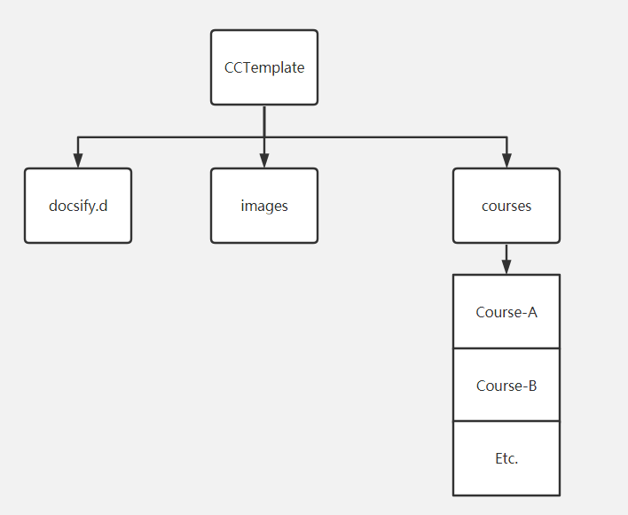

# 仓库介绍
The template of course repository

> 创建之后，需要手动改上面几个链接 主要就是把 `Collection-Course-Template` 改成当前仓库名就好了。

结构设计图

课程增减等需要改动侧边栏的操作，需要改文件 `docsify.d/SideBar.md`

图片放在 **images** 文件夹下

## 免责

***商用禁止*** 

文件和资料皆为同学资源上传或贡献。

- 仓库中所有文件，若侵，联系确认后立删
- 著作权只属于文件作者
- 拒绝未经允许的使用、分发、传播